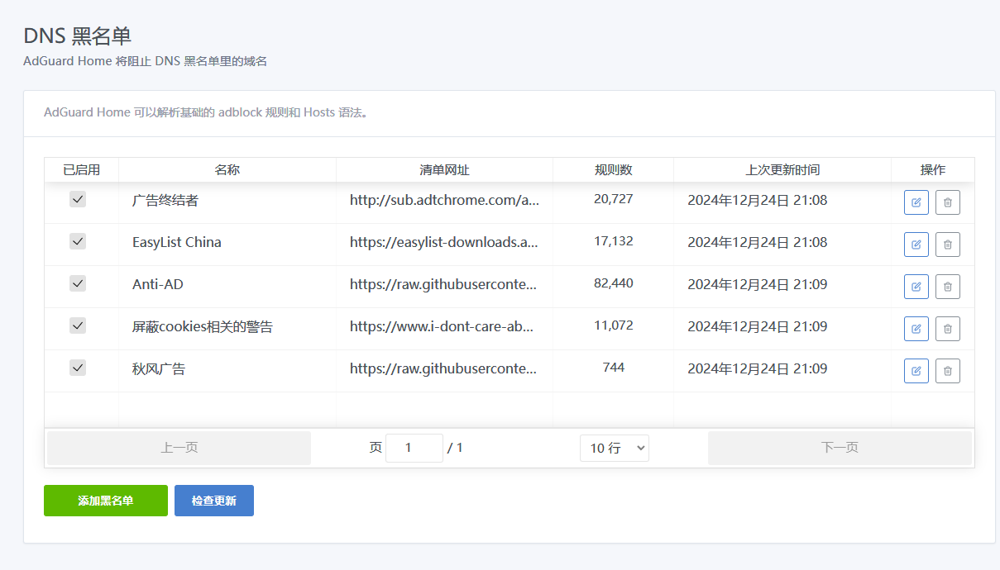
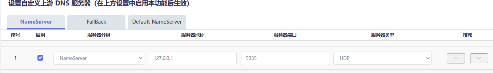

## adgh安装目录需要定期清理的文件
-   /usr/bin/AdGuardHome/data/filters/
-   /usr/bin/AdGuardHome/data/

以上两个路径下存在

.json.1文件:历史日志文件,占用空间大

定期删除脚本:

-   50 5 */5 * * [ -f /usr/bin/AdGuardHome/data/querylog.json.1 ] && rm /usr/bin/AdGuardHome/data/querylog.json.1

txt.old文件:历史规则文件,占用空间大

需要定期删除

## adgh安装中文有一个小bug
luci-i18n-adguardhome-zh-cn_git-22.323.68542-450e04a_all.ipk

安装完成后immortalwrt会变成英文

此时更新一下软件包,输入luci-i18n-base-zh-cn

电机更新该软件包即可,如果没有upgrade就uninstall后重新安装一下

***

## 系统-软件包下
上传安装AdGuardHome时，若提示/etc/crontabs/root no such dirctory

**暂未发现什么影响,可以忽略**

服务重启命令:

-     /etc/init.d/AdGuardHome status/restart/stop/start
                （服务名称）  （控制命令）

## 配置定时任务:

-     vim /etc/contabs/root

-     50 5 * * * [ -f /usr/bin/AdGuardHome/data/querylog.json.1 ] && rm /usr/bin/AdGuardHome/data/querylog.json.1

每天五点五十分检测是否有querylog.json.1文件，有则删除

-     cd /usr/bin/AdGuardHome/data
打开adguardhome数据文件夹。

# AdgrardHome:
工作目录不要修改到临时目录文件夹下，每次重启会消失

（初次设置需更新核心版本，为了防止获取核心版本失败,最好在配置好openclash后开始设置

更新完后点击启用，重定向暂时先不用开启）

## 初始化界面
80端口改成8008（个人习惯更改），53端口（Dnsmasq默认占用端口）改为5335（个人习惯）

设置账号密码后一直下一步进入后台主界面即可。

## 设置-常规设置
基本默认,剩余看图即可

日志配置统计数据时长按自己配置来设置

## 设置-DNS设置
设置2-3个延迟低的DNS即可,推荐运营商DNS

请求选择并行请求,其余两个没用

BootStrap DNS服务器用于解析加密dns,如果有就写,没有就不用

私人反向不用管,默认就好

DNS服务配置按照图来

DNS缓存配置的缓存大小按自己情况来,默认4M,图中设置为10M

一定要勾选乐观缓存:功能为遇到缓存过的请求,首先从缓存内响应,达到1ms响应

## 黑名单
规则参考AdguardHome-rules.md

## 主界面
主界面重定向模式选择无

不需要作为上游服务器来劫持dnsmasq,因为openclash天生与dnsmasq配合最好

## openclash内配置项
本地劫持选择使用dnsmasq转发,勾选禁止缓存

覆写设置内勾选自定义上游dns服务器,如果不在default-nameserver内配置dns的话就不需要勾选respect-rules

nameserver下添加127.0.0.1,端口选择[初始化时设置的端口,文中为5335](#初始化界面)

防火墙选择UDP,仅需要这一条就好

## DHCP/DNS
immortalwrt系统的dhcp/dns下勾选dns重定向

过滤器还是转发下,有一个dns缓存,记得设置为0

