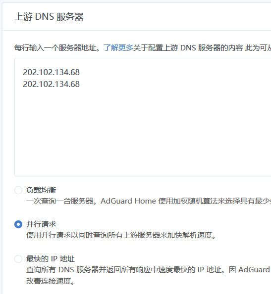
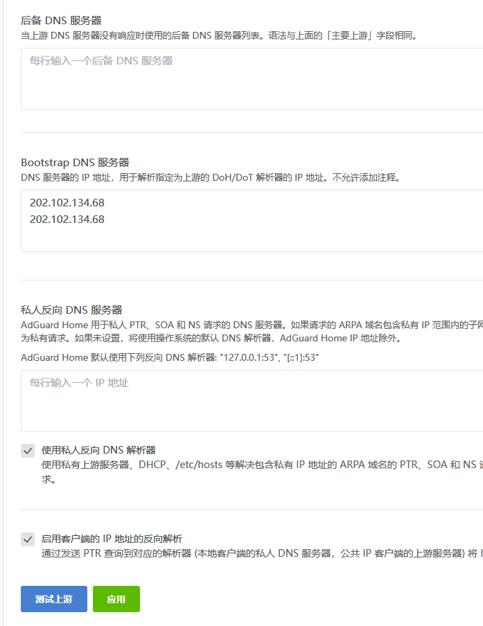
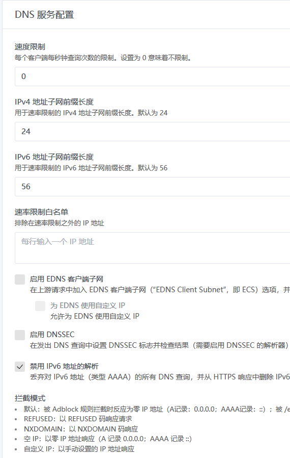
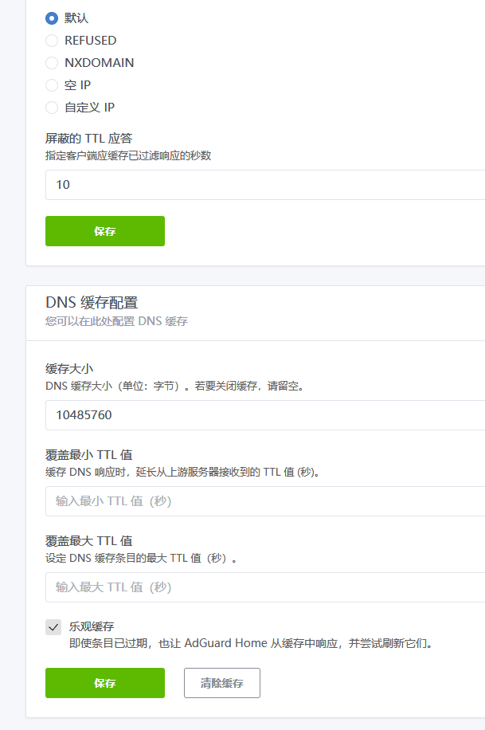
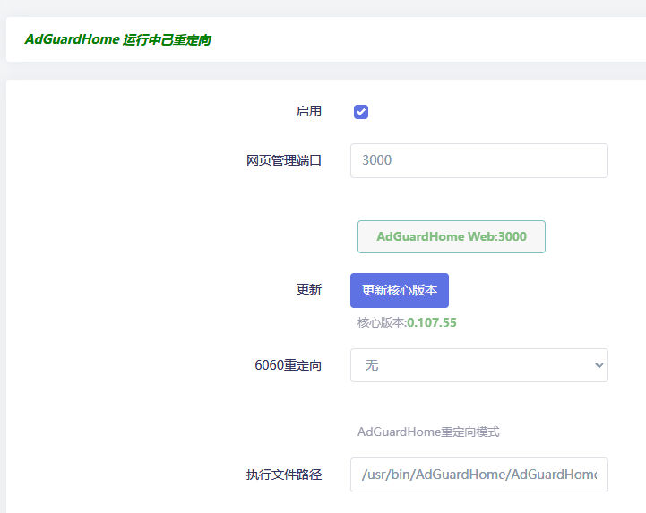
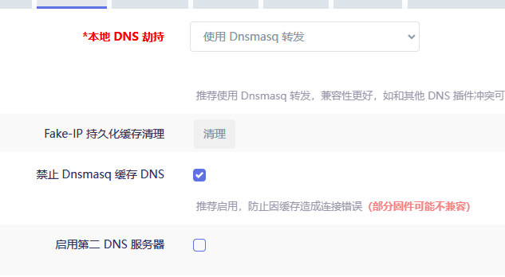
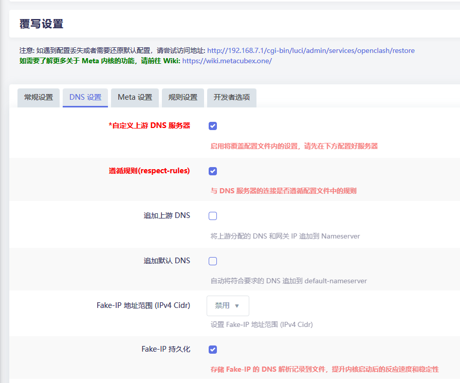
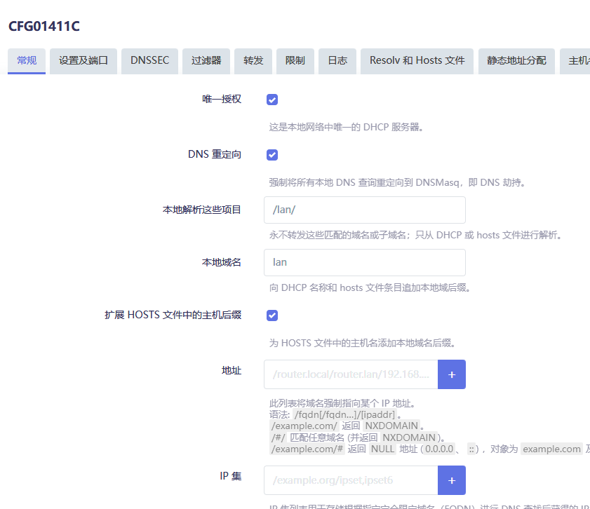

## AdGuardHome 安装目录需要定期清理的文件

以下路径需要定期清理：

- `/usr/bin/AdGuardHome/data/filters/`
- `/usr/bin/AdGuardHome/data/`

### 需要清理的文件类型

**`.json.1` 文件**：历史日志文件，占用空间大

定期删除脚本：

```bash
50 5 */5 * * [ -f /usr/bin/AdGuardHome/data/querylog.json.1 ] && rm /usr/bin/AdGuardHome/data/querylog.json.1
```

**`txt.old` 文件**：历史规则文件，占用空间大，需要定期删除

---

## AdGuardHome 安装中文语言包的小 bug

安装包：`luci-i18n-adguardhome-zh-cn_git-22.323.68542-450e04a_all.ipk`

安装完成后 ImmortalWrt 会变成英文界面。

**解决方法**：

1. 更新软件包，输入 `luci-i18n-base-zh-cn`
2. 点击更新该软件包即可
3. 如果没有 upgrade 选项，则 uninstall 后重新安装

---

## 系统-软件包

上传安装 AdGuardHome 时，若提示 `/etc/crontabs/root no such directory`

> **注意**：暂未发现什么影响，可以忽略

### 服务重启命令

```bash
/etc/init.d/AdGuardHome status/restart/stop/start
# 服务名称        控制命令
```

---

## 配置定时任务

编辑定时任务文件：

```bash
vim /etc/crontabs/root
```

添加以下定时任务（每天五点五十分检测是否有 `querylog.json.1` 文件，有则删除）：

```bash
50 5 * * * [ -f /usr/bin/AdGuardHome/data/querylog.json.1 ] && rm /usr/bin/AdGuardHome/data/querylog.json.1
```

打开 AdGuardHome 数据文件夹：

```bash
cd /usr/bin/AdGuardHome/data
```

---

## AdGuardHome 配置

> **重要提示**：工作目录不要修改到临时目录文件夹下，每次重启会消失。

初次设置需更新核心版本，为了防止获取核心版本失败，最好在配置好 OpenClash 后开始设置。更新完后点击启用，重定向暂时先不用开启。

### 初始化界面

- **80 端口**改成 **8008**（个人习惯更改）
- **53 端口**（Dnsmasq 默认占用端口）改为 **5335**（个人习惯）

设置账号密码后一直下一步进入后台主界面即可。

### 设置-常规设置

基本默认，剩余看图即可。

日志配置统计数据时长按自己配置来设置。


### 设置-DNS 设置

- 设置 2-3 个延迟低的 DNS 即可，推荐运营商 DNS
- 请求选择并行请求，其余两个没用



**BootStrap DNS 服务器**用于解析加密 DNS，如果有就写，没有就不用。

私人反向不用管，默认就好。



DNS 服务配置按照图来：



**DNS 缓存配置**的缓存大小按自己情况来，默认 4M，图中设置为 10M。

一定要勾选**乐观缓存**：功能为遇到缓存过的请求，首先从缓存内响应，达到 1ms 响应。



### 黑名单

[现在用这个](https://github.com/217heidai/adblockfilters)

### 主界面

主界面重定向模式选择**无**。

不需要作为上游服务器来劫持 dnsmasq，因为 OpenClash 天生与 dnsmasq 配合最好。



---

## OpenClash 内配置项

本地劫持选择使用 dnsmasq 转发，勾选禁止缓存。



覆写设置内勾选自定义上游 DNS 服务器，如果不在 default-nameserver 内配置 DNS 的话就不需要勾选 respect-rules。



**nameserver** 下添加 `127.0.0.1`，端口选择[初始化时设置的端口，文中为 5335](#初始化界面)。

防火墙选择 UDP，~~仅需要这一条就好~~。

并且其余 fallback 之类的预填 DNS 全部删除。

### 2025-12-01 更新

最好加上 TCP 的 DNS 服务器。

开启 TCP 可以显著提升 DNS 可靠性，不会造成负面影响。建议同时启用 UDP 与 TCP。

---

## DHCP/DNS

ImmortalWrt 系统的 DHCP/DNS 下勾选 DNS 重定向。

过滤器还是转发下，有一个 DNS 缓存，记得设置为 0。

