# CloudFlare Worker 配置教程

## 参考信息

- **原作者**：[不良林](https://youtu.be/X7CC5jrgazo?si=Ailu8FUGGkwuAMqO)
- **项目地址**：https://github.com/yixuan-ovo/CF-Worker
- **CloudFlare**：https://cloudflare.com

---

## 注册并登录

选择免费版即可，够用。

---

## 创建 Workers

### 步骤 1：创建新的 Workers

点击创建 Workers：

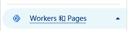

创建一个新的 Workers：

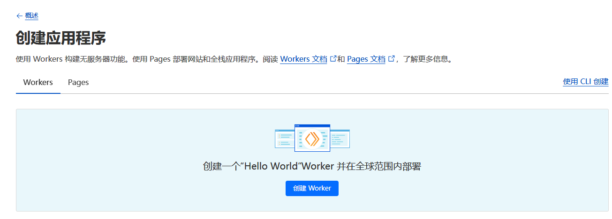

随便定义一个名字即可，随后点击部署：

### 步骤 2：配置环境变量

返回概述，点击创建的 Workers 进入。

进入设置，添加一个新的变量和机密：

- **名称**：`BUCKEND`
- **值**：任意的订阅转换链接

> 搭建自己的订阅转换服务参考[这篇教程](https://github.com/yixuan-ovo/ImmortalWrt-Files/blob/2ba744524f589ff5937f81bdf6a9cac76c1bcbc9/OpenClash/openclash-tutorials/dockerAnalysis.md)

### 步骤 3：编辑代码

设置完后，右上角点击编辑代码，原有示例代码全部删除：

**将[项目地址](#参考信息)下的 `worker.js` 中所有代码复制并部署。**

> **注意**：此时可以点击访问，但并未配置环境变量，所以会报错。

---

## 创建 KV

### 步骤 1：创建 KV 命名空间

点击 KV，创建一个命名空间：

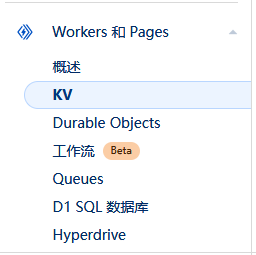

免费版本即可，一月 1000 次请求完全够用，随便命名创建完成。

### 步骤 2：绑定 KV 到 Workers

随后返回 Workers 的设置下，选择绑定项，点击添加：

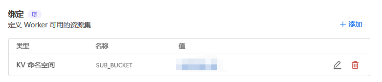

添加资源绑定，选择 KV 命名空间：

> **重要**：变量名称必须输入 `SUB_BUCKET`

完成绑定后选择部署，此时点击右上角访问即可正常进入链接。

### 订阅链接的转换拼接

参考：[订阅链接的转换拼接教程](https://github.com/yixuan-ovo/TutorialFiles_yx/blob/main/%E4%B8%80%E4%B8%AA%E9%93%BE%E6%8E%A5%E5%90%8C%E6%97%B6%E5%AE%9E%E7%8E%B0%E9%85%8D%E7%BD%AE%E6%A8%A1%E6%9D%BF%E5%92%8C%E5%90%8E%E7%AB%AF%E8%AE%A2%E9%98%85%E8%BD%AC%E6%8D%A2.md)

> **提示**：也可选择创建 R2 对象存储，但需要绑定信用卡。

---

## 注册域名

不赘述，各有各的办法。

---

## 绑定 CloudFlare

### 步骤 1：添加站点

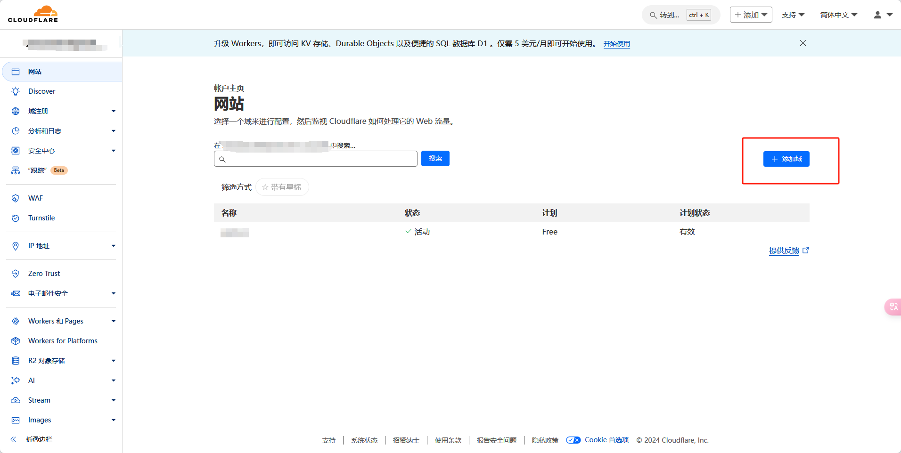

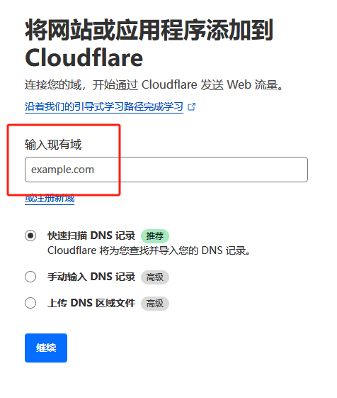

输入自己的域名，套餐选择 **Free** 即可：

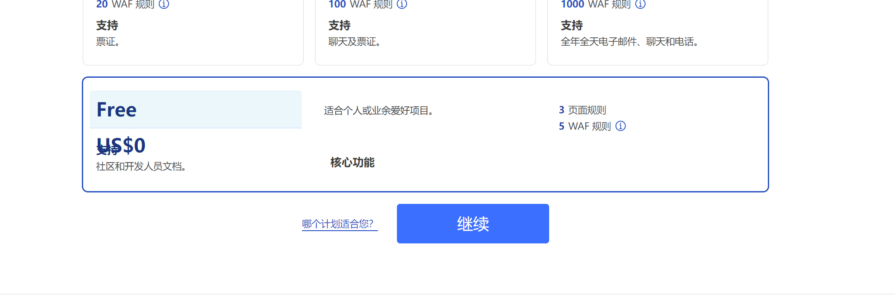

### 步骤 2：配置 DNS

点击继续后，CloudFlare 会自动扫描域名的 DNS 记录，如果是刚刚创建的域名，可能扫描的结果为空，可以直接继续，不用管。

CloudFlare 接下来会要求把域名的 DNS 服务器改为已经分配的服务器，可以截图保存一下：

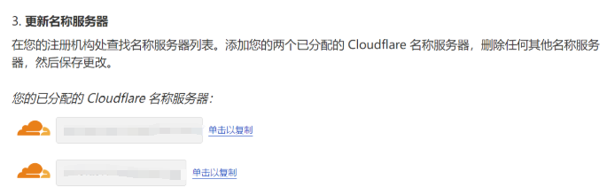

随后前往自己的域名提供商修改域名 DNS 服务器，完成后需要等待一会才可以生效。

### 步骤 3：验证配置

返回 CloudFlare，如果看到"Cloudflare 正在保护您的站点"说明已经配置成功了：

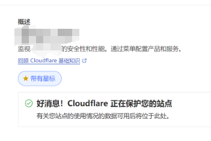

状态显示为"活动"：

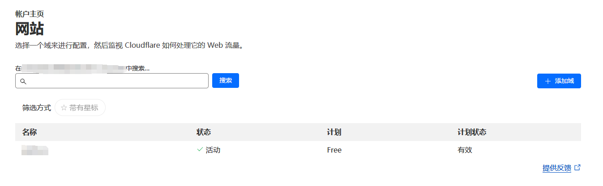

---

## 网站绑定 Workers

进入自己想绑定的 Workers → 设置：

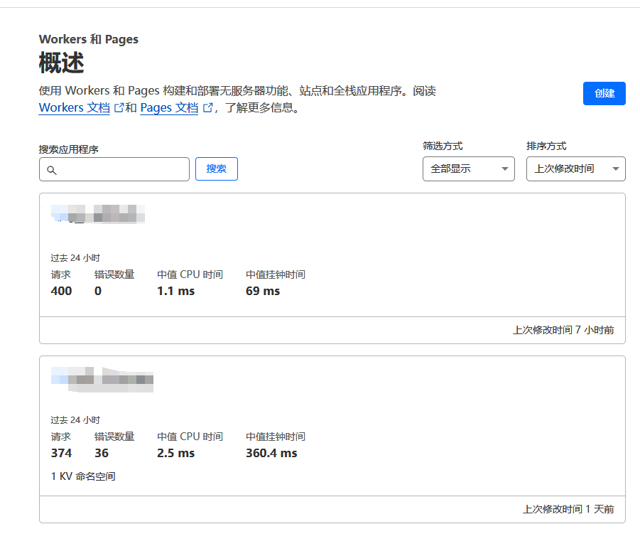

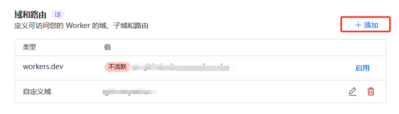

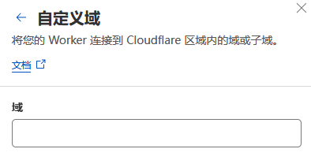

输入自己的域名，可以定义二级域名，例如 `workers.你的域名`。

随后添加域后等待生效。

其余 Workers 同样操作，二级域名可以随便定义。

> **提示**：
> - 如果不需要 `workers.dev` 的链接（主要因为依旧需要过墙），可以在自定义域生效后禁用。
> - 自定义域自带 HTTPS 访问。