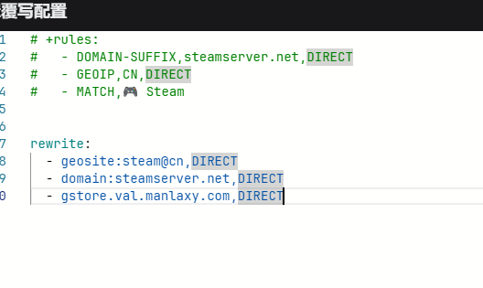
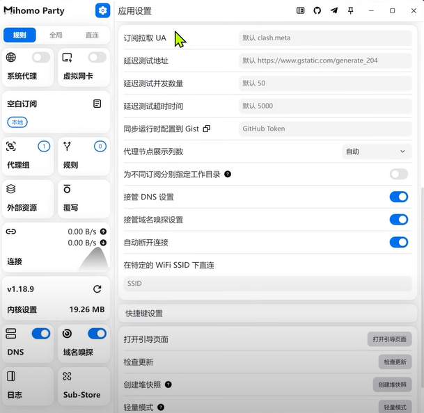
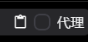
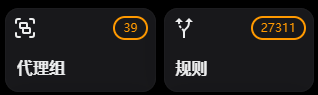
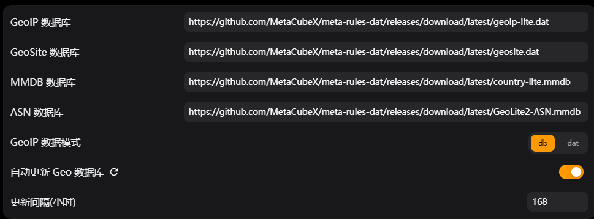
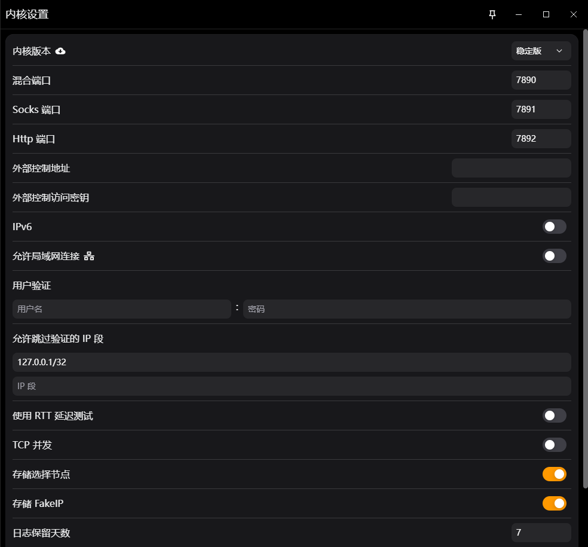
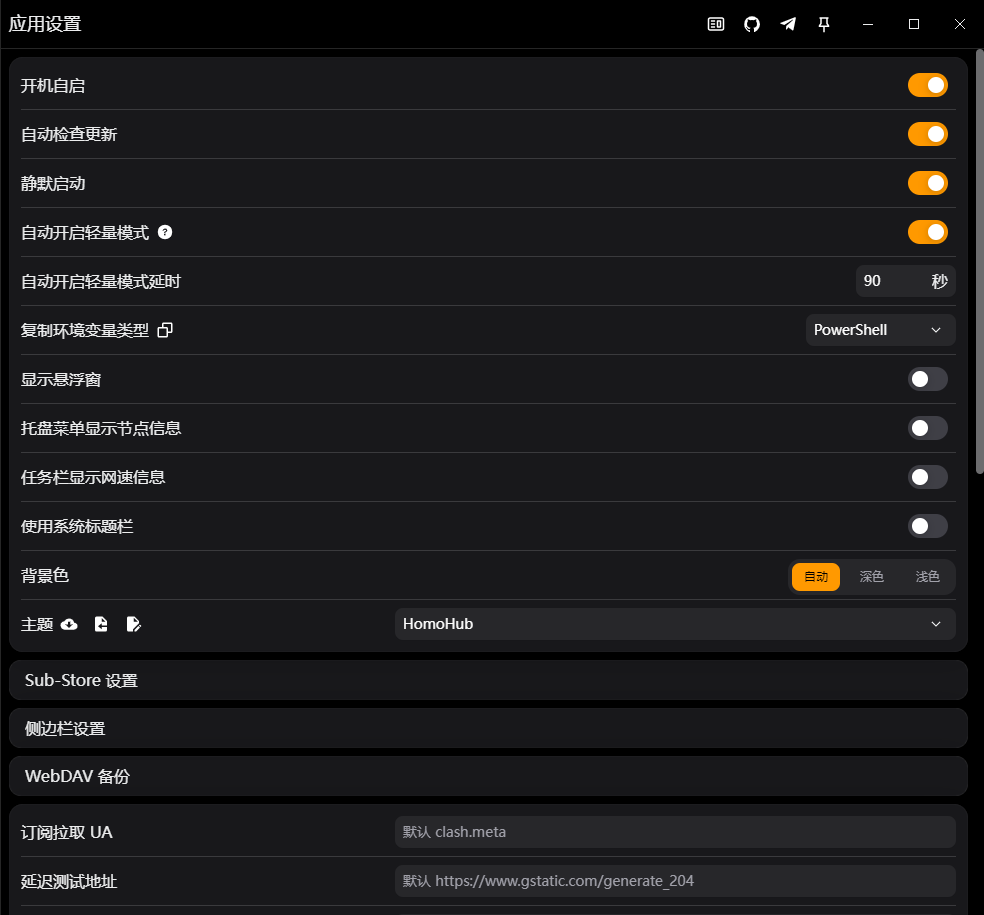

# Sparkle (原 Mihomo) Windows 配置教程

> **2025-06-13 更新**：修改为 Sparkle，Mihomo 暂时弃用，其余配置项相同，不再更改。

---

## 更新日志

### 2025-06-11

DNS 配置更新：

```yaml
dns:
  enable: true
  ipv6: false
  enhanced-mode: fake-ip
  fake-ip-range: 198.18.0.1/16
  fake-ip-filter:
    - "*"
    - +.lan
    - +.local
    - time.*.com
    - ntp.*.com
    - +.market.xiaomi.com
  use-hosts: false
  use-system-hosts: false
  default-nameserver:
    - 219.147.1.66
  nameserver:
    - https://dns.alidns.com/dns-query
  proxy-server-nameserver: []
  direct-nameserver:
    - 219.147.1.66
  nameserver-policy: {}
  respect-rules: false
```

---

### 2025-06-10

**问题**：Mihomo 内核启动失败显示 `geosite.dat` 没找到条目问题，存在点击更新外部资源但是只显示成功不更新文件的 BUG。

**解决方法**：

需要手动将软件安装目录下 `resources-files` 内的下面四个文件下载替换：

- `ASN.mmdb`
- `geoip.dat`
- `geoip.metadb`
- `geosite.dat`

如果为默认路径安装，需要将下方路径 `test` 文件夹内的上面四个文件也手动替换更新一下：

```
C:\Users\yixr\AppData\Roaming\mihomo-party\test
```

如果为手动选择路径，`test` 文件夹应该在软件安装目录下。

---

### 2025-06-06

GeoIP 和 GeoSite 下载链接：

- https://github.com/Loyalsoldier/v2ray-rules-dat/releases/latest/download/geoip.dat
- https://github.com/Loyalsoldier/v2ray-rules-dat/releases/latest/download/geosite.dat

---

### 2024-12-20

完善覆写规则：

```yaml
rewrite:
  - gstore.val.manlaxy.com,DIRECT

+rules:
  - DOMAIN-SUFFIX,yixr.fun,DIRECT
```

---

### 2024-12-16

新增一条漏网之鱼 Steam 下载规则：



---

### 2024-12-12

新增 Steam 规则：除下载外其余 Steam 流量都走代理，Steam 代理组选择代理。

覆写内增加 `steam.yaml` 文件，内容如下：

```yaml
rewrite:
  - geosite:steam@cn,DIRECT
  - domain:steamserver.net,DIRECT
```

> **注意**：上述写法未找到等价代码，等待后续查询资料。经测试暂无问题，等待后续使用验证。表现为下载游戏时连接内看不到下载的速度，应该是走了 `geosite:cn`。

---

### 2024-12-02

需要找一下设置 MihomoParty 的 DNS 解析为当前网络连接的 DNS 的办法，不然需要每次手动改。

---

## 软件地址

- https://github.com/mihomo-party-org/clash-party

---

## 首次启动

需要以管理员身份运行，视情况而定。

初次打开会有一个引导，建议看完。

---

## 主界面



### 选择规则即可

> **重要**：使用之前需要关掉之前的代理。

可以在系统代理和虚拟网卡都不开启的情况下使用，但是此时只能通过 HTTP 或者 Sockets 链接。

日常使用只需要开启系统代理即可，当你知道自己需要虚拟网卡（TUN 模式）时才需要开启该功能。

---

## 空白订阅

粘贴订阅地址即可（需要复制 Clash 或者通用订阅，其余订阅需要进行转换），支持模板自定义订阅转换，参考[这里](https://raw.githubusercontent.com/yixuan-ovo/ImmortalWrt-Files/refs/heads/main/OpenClash/openclash-tutorials/%E4%B8%80%E4%B8%AA%E9%93%BE%E6%8E%A5%E5%90%8C%E6%97%B6%E5%AE%9E%E7%8E%B0%E9%85%8D%E7%BD%AE%E6%A8%A1%E6%9D%BF%E5%92%8C%E5%90%8E%E7%AB%AF%E8%AE%A2%E9%98%85%E8%BD%AC%E6%8D%A2.md)。

**如果你的订阅链接需要代理才可以更新**：

 选中

> **前提**：已经添加另一个不需要代理就可以更新的订阅，普遍情况是直接复制自己的订阅链接先导入。



---

## 外部资源



如果没有其他的链接，默认即可。建议勾选自动更新，否则会影响绕过大陆功能。

---

## 覆写

手搓 YAML 或导入现成 YAML 文件来覆盖自己机场订阅的默认规则，如果不会的话可以参考[空白订阅](#空白订阅)实现。

效果与 YAML 一样（自定义规则仍需自己编辑）。

---

## 连接

此处可进行查阅某些域名/节点是否走代理/直连，可自己写 YAML 进行指定域名的 DIRECT/代理。

### 格式

```
- 前缀,域名,规则
```

### 前缀

- **DOMAIN**：基本前缀，表示一个完整的域名。例如 `DOMAIN example.com`，表示针对 `example.com` 这个域名。

- **DOMAIN-SUFFIX**：表示以指定后缀结束的所有域名。例如 `DOMAIN-SUFFIX example.com` 将匹配 `example.com` 及其所有子域名（如：`www.example.com`、`api.example.com`）。

- **DOMAIN-KEYWORD**：匹配域名中包含特定关键字的所有域名。例如 `DOMAIN-KEYWORD example`，将匹配所有包含 example 的域名（例如 `mail.example.com`、`word.example.com`）。

- **DOMAIN-EXACT**：用于精准匹配特定域名，不包括子域名。例如 `DOMAIN-EXACT example.com` 只会匹配 `example.com`，而不会匹配 `www.example.com`。

#### 参考 IP/掩码计算器

- **IP-CIDR**：`127.0.0.0/8,DIRECT` - 匹配数据目标 IP（直连）

- **SRC-IP-CIDR**：`192.168.1.201/32,DIRECT` - 匹配数据发起 IP（直连）

- **DST-PORT**：`80,DIRECT` - 匹配数据目标端口（直连）

- **SRC-PORT**：`7777,DIRECT` - 匹配数据源端口（直连）

### 规则

- **DIRECT**：直连

- **REJECT**：拒绝连接

- **节点分组**：指定走某个分组

---

## 内核设置



不建议开 IPv6，RTT 延迟测试建议开启。

**RTT 时延**：往返时延，即从发送方发送数据开始，到发送方接收到来自接收方的确认消息所经过的时间。网络拥堵情况下会出现 RTT 时延的波动。

---

## DNS/域名嗅探

建议参考更新的写法，`nameserver` 及 `direct-nameserver` 采用运营商延迟低的，可以[在这里](https://github.com/Kukaina/DnsTools)测试延迟。

默认解析服务器可以使用阿里云：

```
https://dns.alidns.com/dns-query
```

---

## 系统设置




### 轻量模式

关闭客户端仅剩内核运行，减少系统资源占用，类似 V2RayA，但是 Mihomo 比 V2RayA 功能强大太多。

### 主题

点击拉取主题可以进行主题更换。

### Sub-Store

我关了，该功能为自建节点导入/合并订阅源/节点过滤重命名等，我用不到。

### 侧边栏设置

可以点开调整一下左侧使用功能的显示隐藏。

> 其余看自己喜好就行。