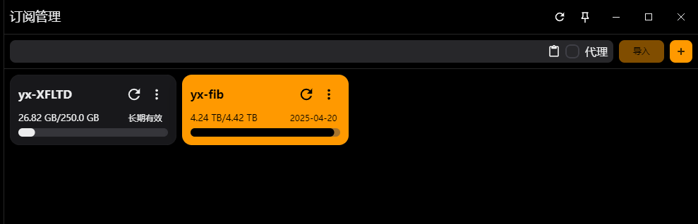

12.12更新:

新增steam规则:除下载外其余steam流量都走代理,steam代理组选择代理

覆写内增加steam.yaml文件,内容如下:
```
rewrite:
  - geosite:steam@cn,DIRECT
  - domain:steamserver.net,DIRECT
```
上述写法未找到等价代码,等待后续查询资料

经测试暂无问题,等待后续使用验证

表现为下载游戏时连接内看不到下载的速度,应该是走了geosite:cn

---

# 软件地址
-       https://github.com/mihomo-party-org/mihomo-party

# 首次启动
可能需要以管理员身份运行，视情况而定

初次打开会有一个引导，建议看完

# 主界面


### 选择规则即可

### **使用之前需要关掉之前的代理**

可以在系统代理和虚拟网卡都不开启的情况下使用,但是此时只能通过http或者sockets链接

日常使用只需要开启系统代理即可，当你知道自己需要虚拟网卡(TUA模式)时才需要开启该功能

## 空白订阅


该位置粘贴进订阅地址即可(需要复制clash或者通用订阅,其余订阅需要进行转换),支持模板自定义订阅转换,参考[这里](https://raw.githubusercontent.com/yixuan-ovo/ImmortalWrt-Files/refs/heads/main/OpenClash/openclash-tutorials/%E4%B8%80%E4%B8%AA%E9%93%BE%E6%8E%A5%E5%90%8C%E6%97%B6%E5%AE%9E%E7%8E%B0%E9%85%8D%E7%BD%AE%E6%A8%A1%E6%9D%BF%E5%92%8C%E5%90%8E%E7%AB%AF%E8%AE%A2%E9%98%85%E8%BD%AC%E6%8D%A2.md)

**如果你的订阅链接需要代理才可以更新**

 选中这里即可

**前提已经添加另一个不需要代理就可以更新的订阅,普遍情况是直接复制自己的订阅链接先导入**

订阅完成后在


可以看到自己的订阅链接及规则

## 外部资源


如果没有其他的链接,默认即可.建议勾选自动更新,否则会影响绕过大陆功能

## 覆写
手搓yaml或导入现成yaml文件来覆盖自己机场订阅的默认规则,如果不会的话可以参考[这里](#空白订阅)实现

效果与yaml一样(自定义规则仍需自己编辑)

## 连接
此处可进行查阅某些域名/节点是否走代理/直连,可自己写yaml进行指定域名的DIRECT/代理

格式:

    - 前缀,域名,规则

### 前缀:
- **DOMAIN**:基本前缀,表示一个完整的域名.例如*DOMAIN example.com*,表示针对*example.com*这个域名

- **DOMAIN-SUFFIX**:表示以指定后缀结束的所有域名.例如*DOMAIN-SUFFIX,example.com*将匹配*example.com*及其所有子域名(如:*www.example.com,api.example.com*)

- **DOMAIN-KEYWORD**:匹配域名中包含特定关键字的所有域名.例如*DOMAIN-HEYWORD example*,将匹配所有包含example的域名(例如*mail.example.com*,*word.example.com*)

- **DOMAIN-EXACT**:用于精准匹配特定域名,不包括子域名.例如*DOMAIN-EXACT example.com*只会匹配 *example.com*,而不会匹配*www.example.com*

#### 参考ip/掩码计算器

- **IP-CIDR**,127.0.0.0/8,DIRECT  匹配数据目标IP(直连)

- **SRC-IP-CIDR**,192.168.1.201/32,DIRECT  匹配数据发起IP(直连)

- **DST-PORT**,80,DIRECT  匹配数据目标端口(直连)

- **SRC-PORT**,7777,DIRECT  匹配数据源端口(直连)

### 规则:
- DIRECT:直连

- REGECT,拒绝连接

- 节点分组,指定走某个分组

## 内核设置

不建议开ipv6,RTT延迟测试建议开启

RTT时延:往返时延,即从发送方发送数据开始,到发送方接收到来自接收方的确认消息所经过的时间.网络拥堵情况下会出现RTT时延的波动.

## DNS/域名嗅探
建议默认,dns可以[在这里](https://github.com/Kukaina/DnsTools)选择延迟低的进行更改

# 系统设置


## 轻量模式
关闭客户端仅剩内核运行,减少系统资源占用,类似V2RayA,但是Mihomo比va功能强大太多

## 主题
点击拉取主题可以进行主题更换

## Sub-Store
我关了,该功能为自建节点导入/合并订阅源/节点过滤重命名等,我用不到

## 侧边栏设置
可以点开调整一下左侧使用功能的显示隐藏

## *其余看自己喜好就行*


# 施工完毕!