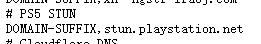
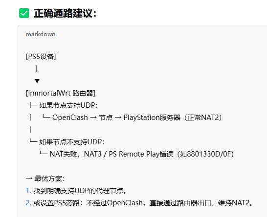
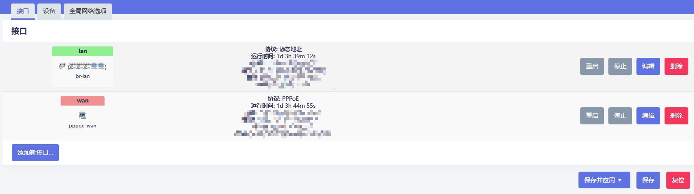
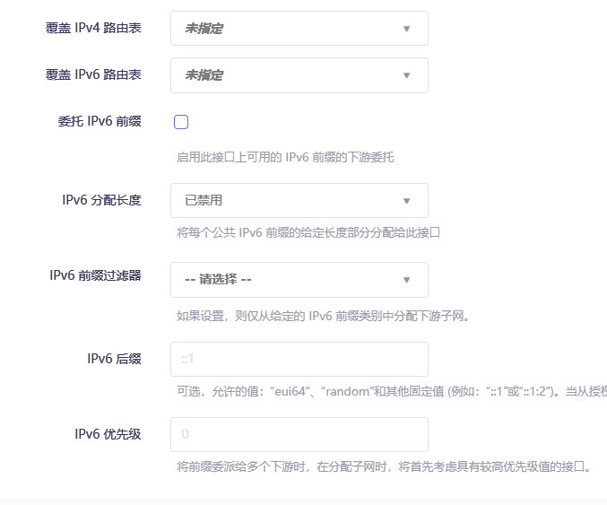
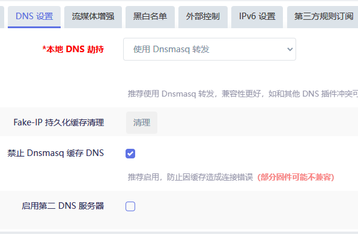
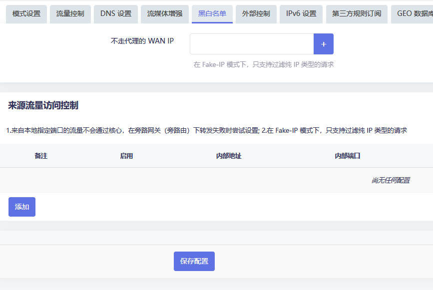
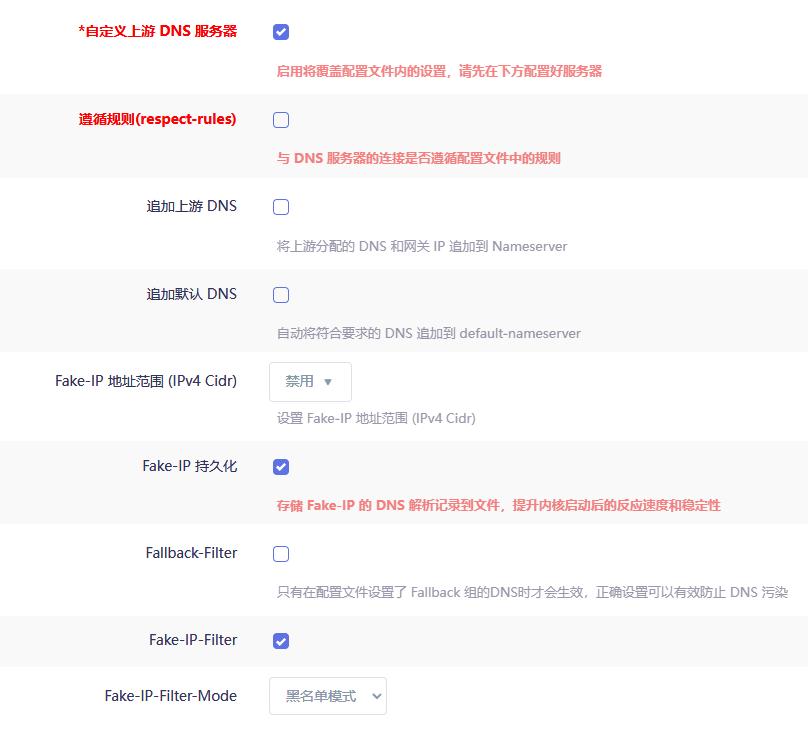
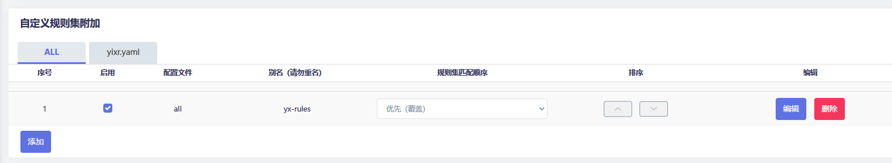

# OpenClash 配置教程

> **提示**：谷歌 FCM 是推送服务，谷歌服务 → 谷歌服务。

---

## 更新日志

### 2025-08-27

增加了 `/tmp/etc/openclash` 的路径备份，名为 `tmp-bak`。

便于更新 OpenClash 版本后快速启动，否则会全部丢失。

---

### 2025-08-08

更新了 Smart 内核，目前收集数据中，等待训练成自己的模型。

后台订阅转换寄了，需要换一个订阅后台连接。

---

### 2025-06-25

OpenClash 更新路径 404，版本更新里面没有新版本的解决办法：更换了 dev 版本的更新路径，手动更新好之后即可恢复正常。

```
https://github.com/vernesong/OpenClash/tree/package/dev
```

---

### 2025-04-17

规则也不行，现在怀疑是开了绕过大陆，导致两边返回的信息不一样，可以尝试一下。

---

### 2025-04-16

```
ruleset=🚀 强制代理,https://raw.githubusercontent.com/Aethersailor/Custom_OpenClash_Rules/main/rule/Custom_Proxy.list,28800
```

发现这一条里面有 PS5 NAT 类型测试：



指定走节点试一下。

> **反馈**：不行，试一下另外那个规则，如果还是不行那就是节点问题了。

---

### 2025-04-15（下）

发现只要关闭 OpenClash，Remote 就可以直接连上了。

此时 UPNP 活动的协议有：
||||主机名称||描述|协议|
|-|-|-|-|-|-|-|
|UDP|9308|192.168.7.233|ps5-proxy|9308|192.168.7.233:9308 to 9308|(UDP)|
|UDP|8572|192.168.7.233|ps5-proxy|8572|192.168.7.233:8572 to 8572|(UDP)|
|UDP|9303|192.168.7.233|ps5-proxy|9303|192.168.7.233:9303 to 9303|(UDP)|
|UDP|57448|192.168.7.233|ps5-proxy|57448|192.168.7.233:57448 to 57448|(UDP)|
|UDP|9297|192.168.7.233|ps5-proxy|9297|192.168.7.233:9297 to 9297|(UDP)|

目前看来 UPNP 可以一直开着，不需要手动防火墙开端口了。

现在需要测试开启 OpenClash 之后，~~黑白名单里面加入不走核心的 WAN IP，是否也是同样效果~~。

> **反馈**：应该在"来源流量访问控制"里面添加需要不走核心的 IP。

如下图设置，可以使指定 IP 不走 OpenClash 核心，此时借助 UPNP 可以实现 Remote 连接成功：


目前对 OpenClash 的修改为：

- 删除了覆写设置的 -ip188 的直连，因为走核心还是会 NAT 失败
- 防火墙恢复默认设置
- 删除了覆写设置-DNS 设置-Fake-IP-Filter-Mode 关于 PlayStation 的域名
- 增加了不走核心的 WAN-IP-188

**破案了，节点不支持 UDP** ~~只剩下解决开着 OpenClash 时 PS5-NAT 类型失败的问题了~~。



但是更换支持 UDP 转发的节点也无法远程成功？？

应该是走 NAT 的 STUN 域名没有走 UDP 节点。

---

### 2025-04-15（上）

增强和 TUN 好像对 NAT 类型获取没什么太大作用，现在改回增强灯光也正常。

在覆写设置-DNS 设置-Fake-IP-Filter-Mode 里面把以下域名加入到域名列表：

- `*.playstation.net`
- `*.stun.playstation.net`
- `*.sonyentertainmentnetwork.com`
- `*.sony.com`

~~在防火墙的常规设置里面将出入站转发都设置为接受~~

~~防火墙-端口转发里面增加了两条端口转发~~

- **8572**：PS Remote Play 所需的 UDP 端口
- **3478-3479**：针对 STUN 这个获取 NAT 类型域名的端口

---

### 2025-04-14

~~模式设置-fakeip 增强模式存在 NAT 问题~~

~~表现为 PS5 获取 NAT 类型不稳定，此时需要使用 TUN 混合模式~~

~~神奇的是改成 TUN 模式后，路由器灯光也变成蓝绿正常灯光了~~

另外新增 `yx_clash.ini` 配置文件，OpenClash 专用。

---

## 提示

### 网络-DHCP/DNS-静态地址分配

配置主机名和 MAC 地址绑定：


### 软件包替换源

将源地址：`https://downloads.immortalwrt.org`

修改为：

```
https://mirrors.cernet.edu.cn/immortalwrt
```

### 常用软件包名

| 包名 | 备注 |
|------|------|
| luci-theme-argon | **Argon 主题** |
| luci-app-adguardhome | **最新版 CN 语言包 bug 解决见 adhome_config** |
| | ~~建议下载 20221023，自带中文。最新版安装英文后再安装中文好像有冲突~~ |
| *~~luci-app-arpbind~~* | *~~IP/MAC 地址绑定~~* |
| | 自带，不用搞这个 |
| luci-app-openclash | |
| luci-app-upnp | 安装 zh-cn 语言包，其余自动安装 |

---

## ImmortalWrt 关闭 IPv6

### LAN 口

**网络-接口**：删除 wan6 接口，编辑 br-lan 接口：



**DHCP 服务器-IPv6 设置**：禁用三个 IPv6 服务，不勾选指定的主接口：




**全局网络选项**删除 IPv6 地址：


**网络-DHCP/DNS-过滤器**：勾选过滤 IPv6 AAAA 记录：


以上操作之后设备禁用 IPv6 地址。

### WAN 口

> **重要**：br-lan 的网段不可以和 WAN 的网段相同。

接口配置 WAN 口禁用获取 IPv6 地址：


---

## OpenClash 插件设置

### 插件-模式设置

新版本默认只有 Meta 内核，使用 FakeIP 增强模式就行。

勾选 UDP 流量转发。

代理模式 Rule：


### 插件-流量控制

勾选路由本机代理、禁用 QUIC、绕过服务器地址、实验性绕过中国大陆 IP（配置延迟低的 DNS）、仅允许内网。

仅允许内网下方选择 WAN 接口名字为 `pppoe-wan`（个人配置不同）。

LAN 接口配置为 `br-lan`。


### 插件-DNS 设置

使用 Dnsmasq 进行转发。

清理一下持久化缓存，勾选禁止 Dnsmasq 缓存 DNS。



### 插件-流媒体增强

忽略。

### 插件-黑白名单（覆写设置-规则设置）

- `SRC-IP-CIDR,192.168.7.233/32,DIRECT` - 意为 7.233 IP 设备走直连

- `SRC-IP-CIDR,192.168.7.233/32,节点分组名` - 意为 7.233 IP 设备走指定节点分组。例如：`SRC-IP-CIDR,192.168.7.233/32,🚀 手动切换`

经测试发现黑白名单和自定义规则都可以实现不走代理。

区别在于黑白名单只能定义 IP。

自定义规则可以定义域名：

- `DOMAIN-SUFFIX,google.com,（代理组名）` - 匹配域名后缀，意为 `xxx.google.com` 走代理
- `DOMAIN-KEYWORD,google,DIRECT（代理组名）` - 匹配域名关键字，意为域名含有 google 的走 DIRECT
- `DOMAIN,google.com,DIRECT（代理组名）` - 匹配域名，意为全域名匹配成功的走 DIRECT



### 插件-外部控制

忽略。

### 插件-IPv6 设置

取消勾选，不使用 IPv6。


### 插件-GEO 数据库订阅

可以使用默认链接。

**GeoIP-MMDB**：
- https://github.com/Hackl0us/GeoIP2-CN/raw/release/Country.mmdb
- 链接来源仓库：https://github.com/Hackl0us/GeoIP2-CN?tab=readme-ov-file

**GeoIP-Dat**：
- https://github.com/Loyalsoldier/v2ray-rules-dat/releases/latest/download/geoip.dat
- 链接来源仓库：https://github.com/Loyalsoldier/v2ray-rules-dat

> **注意**：geoipDat 老版本数据库，文件太大，不采用。

> **重要**：每天或每周更新一次，设置完自定义 URL 后点击检查并更新进行更新，单纯点击保存配置没有用。


### 插件-大陆白名单订阅

勾选自动更新，其余默认即可。

可选其余 URL：


- **IPv4 URL**：https://raw.githubusercontent.com/mayaxcn/china-ip-list/master/chnroute.txt
- **IPv6 URL**：https://raw.githubusercontent.com/mayaxcn/china-ip-list/master/chnroute_v6.txt

> **注意**：这俩跟默认没有区别。


---

## OpenClash 覆写设置

### 覆写-常规设置

> **重要**：如果更新订阅出现【tmp/yaml_sub_tmp_config.yaml】下载失败等无法连接 GitHub 错误。

在覆写设置-Github 地址修改中自定义 GitHub 的解析地址：


### 覆写-DNS 设置

勾选 Fake-IP 持久化，Fake-IP-Filter。

勾选自定义上游服务器。

在 AdGuard 配置好后（参考 new_adguardhome_config）。

下方 nameserver 输入 `127.0.0.1:5335` UDP+TCP。



### 覆写-Meta 设置

勾选启用 TCP 并发、启用统一延迟（为了测速好看，可开可不开）、Fake-IP 持久化、启用流量（域名）探测、探测（嗅探）纯 IP 连接。

其余停用或不勾选。


### 覆写-规则设置

参考上方黑白名单。


### 覆写-开发者选项

> **注意**：新版本没有配置项，可忽略。

---

## OpenClash 规则附加

按如图配置即可，更新 push 后过几分钟更新规则即可生效，避免重启服务，链接如下：

```
https://raw.githubusercontent.com/yixuan-ovo/TutorialFiles_yx/refs/heads/main/OpenClash/direct_rules/yx_direct.yaml
```




---

## OpenClash 配置订阅

> **重要**：漏网之鱼不能选全球直连！选择直连会泄露 DNS。此时在绕过大陆 IP 选项的作用下，国内 IP 不会走 Clash 内核。

测试 DNS 泄露网址：https://browserleaks.com/dns

### 勾选自动更新，修改配置文件

勾选在线订阅转换，订阅转换服务地址 clash-meta，订阅转换模板为自定义模板。

参考：[一个链接同时实现配置模板和后端订阅转换](/TutorialFiles_yx/一个链接同时实现配置模板和后端订阅转换.md)

添加 Emoji 可开，UDP 启用，规则集启用，增加节点类型可开可不开。

---

## 下一步配置

[下一步配置 AdGuardHome 在这里](/AdGuardHome_yx/New_ADGuardHome_config.md)