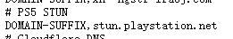
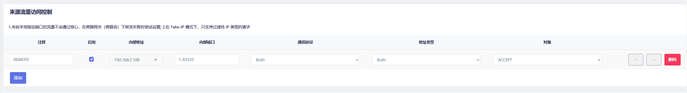
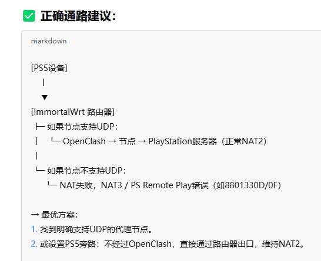
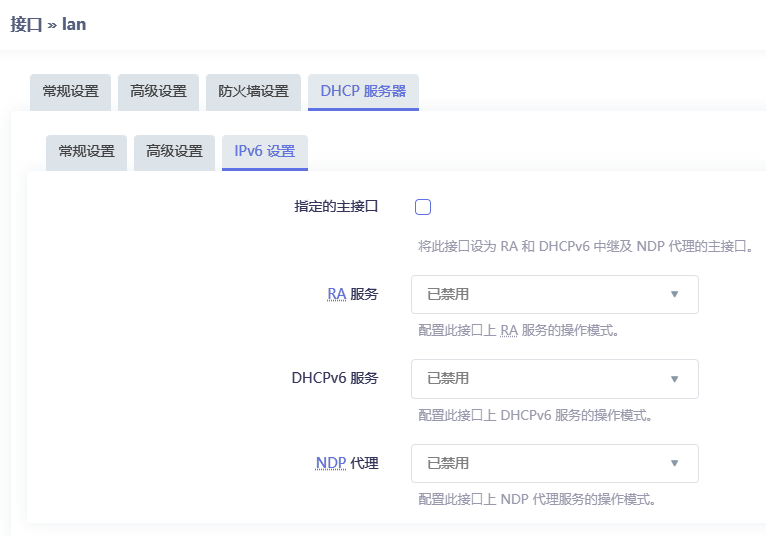
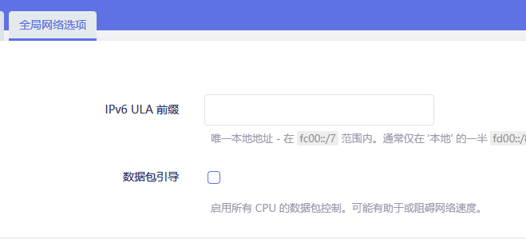
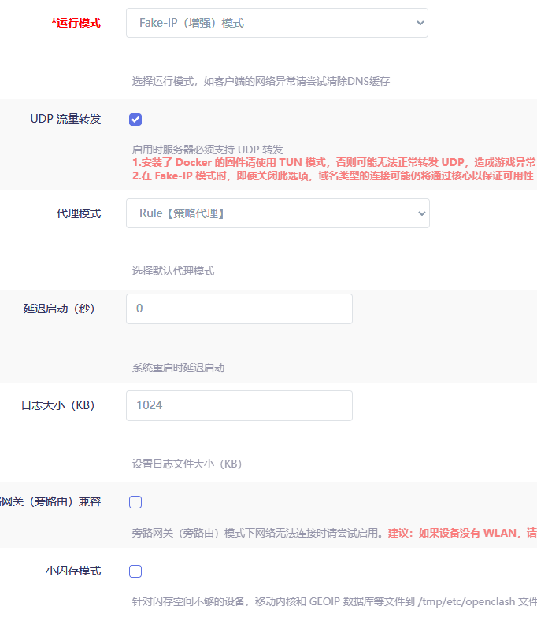

# 更新

## 2025.4.16

    ruleset=🚀 强制代理,https://raw.githubusercontent.com/Aethersailor/Custom_OpenClash_Rules/main/rule/Custom_Proxy.list,28800

发现这一条里面有ps5nat类型测试

指定走节点试一下

    反馈:不行,试一下另外那个老哥的规则,如果还是不行那就是节点问题了

## 2025.4.15-下

发现只要关闭openclash,就remote就可以直接连上了
此时UPNP活动的协议有
||||主机名称||描述|协议|
|-|-|-|-|-|-|-|
|UDP|9308|192.168.7.233|ps5-proxy|9308|192.168.7.233:9308 to 9308|(UDP)|
|UDP|8572|192.168.7.233|ps5-proxy|8572|192.168.7.233:8572 to 8572|(UDP)|
|UDP|9303|192.168.7.233|ps5-proxy|9303|192.168.7.233:9303 to 9303|(UDP)|
|UDP|57448|192.168.7.233|ps5-proxy|57448|192.168.7.233:57448 to 57448|(UDP)|
|UDP|9297|192.168.7.233|ps5-proxy|9297|192.168.7.233:9297 to 9297|(UDP)|

目前看来upnp可以一直开着,不需要手动防火墙开端口了

现在需要测试开启openclash之后,~~黑白名单里面加入不走核心的wanip,是否也是同样效果~~

    反馈:应该在'来源流量访问控制'里面添加需要不走核心的ip

    如下图设置,可以使指定ip不走openclash核心,此时借助upnp可以实现remote连接成功

目前对openclash的修改为:

    删除了覆写设置的-ip188的直连,因为走核心还是会nat失败
    防火墙恢复默认设置
    删除了覆写设置-DNS设置-Fake-IP-Filter-Mode关于playstation的域名
    增加了不走核心的wan-ip-188

**破案了,节点不支持udp**  ~~只剩下解决开着openclash时ps5-nat类型失败的问题了~~

但是更换支持udp转发的节点也无法远程成功??

应该是走nat的stun域名没有走udp节点

## 2025.4.15-上

增强和tun好像对nat类型获取没什么太大作用,现在改回增强灯光也正常

在覆写设置-DNS设置-Fake-IP-Filter-Mode里面把

- *.playstation.net
- *.stun.playstation.net
- *.sonyentertainmentnetwork.com
- *.sony.com

加入到域名列表

~~在防火墙的常规设置里面将出入站转发都设置为接受~~

~~防火墙-端口转发里面增加了两条端口转发~~

8572为ps remote play所需的UDP端口

3478-3479为针对stun这个获取NAT类型域名的端口

## 2025.4.14

~~模式设置-fakeip增强模式存在NAT问题~~

~~表现为ps5获取nat类型不稳定,此时需要使用TUN混合模式~~

~~神奇的是改成tun模式后,路由器灯光也变成蓝绿正常灯光了~~

另外新增yx_clash.ini配置文件,openclash专用

---

# tips:
网络-DHCP/DNS-静态地址分配

配置主机名和MAC地址绑定

## 软件包替换源:
将源地址:https://downloads.immortalwrt.org

修改为:

    https://mirrors.cernet.edu.cn/immortalwrt

## 常用软件包名:
|包名|备注|
|-|-|
|luci-theme-argon|**argon主题**|
|luci-app-adguardhome|**最新版cn语言包bug解决见adhome_config**|
||~~建议下载20221023，自带中文。最新版安装英文后再安装中文好像有冲突~~|
|*~~luci-app-arpbind~~*|*~~IP/MAC地址绑定~~*|
||自带,不用搞这个|
|luci-app-openclash||
|luci-app-upnp|安装zh-cn语言包,其余自动安装|

---

# immortalwrt关闭ipv6:
## lan口
网络-接口:删除wan6接口，编辑br-lan接口

DHCP服务器-ipv6设置:禁用三个ipv6服务，不勾选指定的主接口

全局网络选项删除ipv6地址

## 网络-DHCP/DNS-过滤器
勾选过滤ipv6 AAAA记录

以上操作之后设备禁用ipv6地址

## wan口
**br-lan的网段不可以和wan的网段相同**

接口配置wan口禁用获取ipv6地址

---

# openclash插件设置:

## 插件-模式设置
新版本默认只有meta内核,使用fakeip增强模式就行

勾选UDP流量转发

代理模式Rule

## 插件-流量控制
勾选路由本机代理、禁用QUIC、绕过服务器地址、实验性绕过中国大陆IP（配置延迟低的dns）、仅允许内网

仅允许内网下方选择wan接口名字为pppoe-wan（个人配置不同）

lan接口配置为br-lan

## 插件-DNS设置
使用Dnsmasq进行转发

清理一下持久化缓存，勾选禁止Dnsmasq缓存DNS

## 插件-流媒体增强
忽略

## 插件-黑白名单（复写设置-规则设置）:

- SRC-IP-CIDR,192.168.7.233/32,DIRECT	

（意为7.233ip设备走直连

- SRC-IP-CIDR,192.168.7.233/32,节点分组名	

（意为7.233ip设备走指定节点分组。例如:- SRC-IP-CIDR,192.168.7.233/32,🚀 手动切换

经测试发现黑白名单和自定义规则都可以实现不走代理

区别在于黑白名单只能定义ip

自定义规则可以定义域名:

- DOMAIN-SUFFIX,google.com,（代理组名） #匹配域名后缀，意为xxx.google.com走代理
- DOMAIN-KEYWORD,google,DIRECT（代理组名） #匹配域名关键字，意为域名含有google的走DIRECT
- DOMAIN,google.com,DIRECT（代理组名） #匹配域名，意为全域名匹配成功的走DIRECT

## 插件-外部控制
忽略

## 插件-IPV6设置
取消勾选，不使用IPV6

## 插件-GEO数据库订阅
可以使用默认链接

GeoIP-MMDB:
- https://github.com/Hackl0us/GeoIP2-CN/raw/release/Country.mmdb

链接来源仓库:https://github.com/Hackl0us/GeoIP2-CN?tab=readme-ov-file

GeoIP-Dat:
- https://github.com/Loyalsoldier/v2ray-rules-dat/releases/latest/download/geoip.dat

链接来源仓库:https://github.com/Loyalsoldier/v2ray-rules-dat

**geoipDat老版本数据库，文件太大，不采用**

**每天或每周更新一次，设置完自定义URL后点击检查并更新进行更新，单纯点击保存配置没有用**

## 插件-大陆白名单订阅:
勾选自动更新，其余默认即可

可选其余URL:

ipv4URL:
- https://raw.githubusercontent.com/mayaxcn/china-ip-list/master/chnroute.txt

ipv6URL:
- https://raw.githubusercontent.com/mayaxcn/china-ip-list/master/chnroute_v6.txt

**这俩跟默认没有区别**

---

# openclash复写设置:
## 复写-常规设置:
**如果更新订阅出现【tmp/yaml_sub_tmp_config.yaml】下载失败等无法连接github错误**

在覆写设置-Github地址修改中自定义github的解析地址

## 复写-DNS设置:
勾选Fake-ip持久化，Fake-IP-Filter

勾选自定义上游服务器

在adguard配置好后(参考new_adguardhome_config)

下方nameserver输入127.0.0.1:5335  UDP

---

## 复写-Meta设置:
勾选启用TCP并发、启用统一延迟（为了测速好看，可开可不开）、Fake-IP持久化、启用流量(域名)探测、探测(嗅探)纯IP连接

其余停用或不勾选

## 复写-规则设置:
参考上方黑白名单

## 复写-开发者选项:
**新版本没有配置项,可忽略**

# openclash规则附加:
按如图配置即可,更新push后过几分钟更新规则即可生效,避免重启服务,链接如下:

    https://raw.githubusercontent.com/yixuan-ovo/TutorialFiles_yx/refs/heads/main/OpenClash/direct_rules/yx_direct.yaml

# openclash配置订阅
**漏网之鱼不能选全球直连！选择直连会泄露DNS。此时在绕过大陆ip选项的作用下，国内ip不会走clash内核**

测试dns泄露网址:https://browserleaks.com/dns

# 勾选自动更新，修改配置文件:
勾选在线订阅转换，订阅转换服务地址clash-meta，订阅转换模板为自定义模板

参考[一个链接同时实现配置模板和后端订阅转换](/TutorialFiles_yx/一个链接同时实现配置模板和后端订阅转换.md)

添加Emoji可开，UDP启用，规则集启用,增加节点类型可开可不开

---

# [下一步配置AdGuardHome在这里](/AdGuardHome_yx/New_ADGuardHome_config.md)