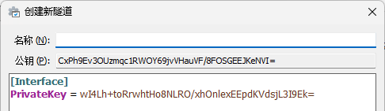
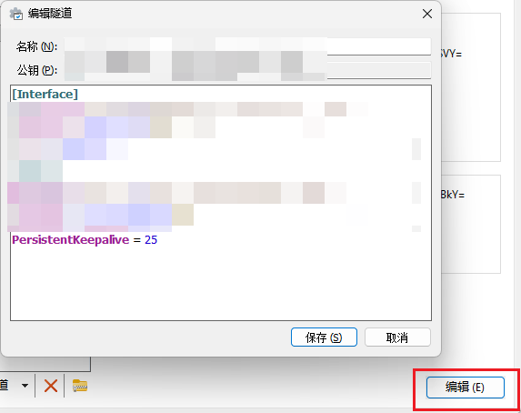
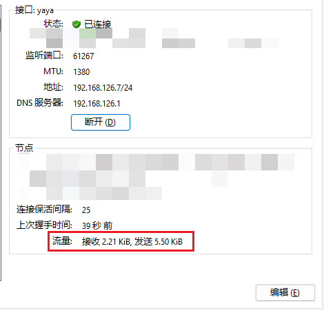

# WireGuard 配置教程

## 前置要求

- 部署在带公网 IP 的服务器
- 安全组放行 UDP 51820 端口
- 服务器带宽最好大一点

## 服务端配置

### 1. 安装 WireGuard

```bash
sudo apt update
sudo apt install -y wireguard iptables iptables-persistent
```

> **注意**：上面命令顺便安装了 iptables，建议安装之前先检查一下服务器有没有自带 iptables：
> 
> ```bash
> iptables -v
> ```

确认安装成功：

```bash
wg -v
```

### 2. 开启 IP 转发

编辑系统配置文件：

```bash
echo "net.ipv4.ip_forward=1" | sudo tee -a /etc/sysctl.conf
```

应用配置：

```bash
sudo sysctl -p
```

### 3. 生成服务器密钥

```bash
cd /etc/wireguard
sudo bash -c 'umask 077; wg genkey | tee server.key | wg pubkey > server.pub'
```

查看生成的密钥：

```bash
l
cat server.key  # 私钥
cat server.pub  # 公钥
```

> **重要**：记住这两个私钥和公钥

### 4. 配置服务端

编辑配置文件：

```bash
sudo nano /etc/wireguard/wg0.conf
```

填写如下内容：

```ini
[Interface]
# 服务器在虚拟局域网中的 IP,可自定义
Address = 192.168.126.1/24

# WireGuard 监听端口
ListenPort = 51820

# 填写服务器的私钥 (cat /etc/wireguard/private.key)
PrivateKey = <YOUR_SERVER_PRIVATE_KEY>

# 【关键】MTU 设置为 1280，防止游戏大数据包分片丢弃导致的 Index Error
MTU = 1380

# 【关键】转发与 NAT 规则 (根据eth0修改,ip addr查看网卡名)

# 开启时：允许转发并开启 IP 伪装
PostUp = iptables -A FORWARD -i wg0 -j ACCEPT; iptables -A FORWARD -o wg0 -j ACCEPT; iptables -t nat -A POSTROUTING -o eth0 -j MASQUERADE

# 关闭时：清理相关规则
PostDown = iptables -D FORWARD -i wg0 -j ACCEPT; iptables -D FORWARD -o wg0 -j ACCEPT; iptables -t nat -D POSTROUTING -o eth0 -j MASQUERADE
```

```
# 1. 允许 WireGuard 隧道端口进入 (必须)
sudo iptables -A INPUT -p udp --dport 51820 -j ACCEPT

# 2. 允许联机工具端口进入 (针对你的直连模式需求)
sudo iptables -A INPUT -p udp --dport 9050 -j ACCEPT

# 3. 允许虚拟网卡 wg0 的所有入站流量 (可选，但联机最稳)
sudo iptables -A INPUT -i wg0 -j ACCEPT

# 4. 允许转发规则 (必须，确保 wg0 和 eth0 之间能传数据)
sudo iptables -A FORWARD -i wg0 -j ACCEPT
sudo iptables -A FORWARD -o wg0 -j ACCEPT

# 5. 如果开启了UFW，防止底层 iptables 规则不会被上层的 UFW 策略拦截。
sudo ufw default allow routed

# 6. 永久保存这些规则 (确保重启服务器后依然生效)
sudo netfilter-persistent save
```

### 5. 启动服务

启动服务，检查是否报错：

```bash
sudo systemctl enable wg-quick@wg0
sudo systemctl start wg-quick@wg0
```

## 客户端配置

### 1. 创建新隧道

如果服务端成功启动，下载一个 WireGuard 客户端。

点击左下角**新建空隧道**：


名称随便写，记住**公钥**和 **PrivateKey**，点击保存：



### 2. 配置客户端

接下来点击右下角**编辑**，输入如下配置，点击保存：

```ini
[Interface]
PrivateKey = (新增隧道自动生成的私钥,不需要动)
# 自己设置的ip,后面一般写/24
Address = 192.168.126.77/24
# 服务器端设置网段的网关
MTU = 1380

[Peer]
PublicKey = (服务器端的公钥)
# 服务器端设置的网段
AllowedIPs = 192.168.126.0/24
Endpoint = 服务器的公网IP:开放的UDP端口号
# 链接保活间隔
PersistentKeepalive = 25
```



### 3. 配置服务端 Peer

还需要设置服务器端的配置文件：

```bash
sudo nano /etc/wireguard/wg0.conf
```

在配置文件中添加：

```ini
[Peer]
# 添加的第一位用户
PublicKey = 隧道的公钥
# 自己设定的本机ip,与客户端一致
AllowedIPs = 192.168.126.77/32
```

保存后重载服务：

```bash
sudo systemctl restart wg-quick@wg0
```

### 4. 测试连接

客户端点击连接，如果一切正常，下方节点的流量应该是接收与发送都在涨，并且可以 ping 通 `192.168.xxx.1`：



## 添加其他用户

如果需要添加其他用户，复制并修改公钥和 IP 即可，服务器端也需要添加对应的 IP。

## 防火墙配置

Windows 防火墙： 入站规则放行 UDP 9050。

如果都能 ping 通 `.1`，但是互相 ping 不通，需要在电脑防火墙进行配置：

1. 打开**防火墙** → **高级设置** → **入站规则** → **新建规则**
2. 依次选择：
   - **自定义**
   - **所有程序**
   - **协议类型**：任何
   - **添加远程 IP**（自己设定的网段的 IP/24）
   - **允许连接**
   - **三个全选**
   - **名称**建议填写：WireGuard

配置完成后即可互相 IP 之间 ping 通了。
