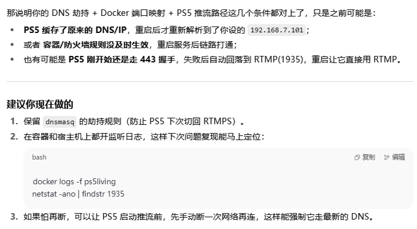
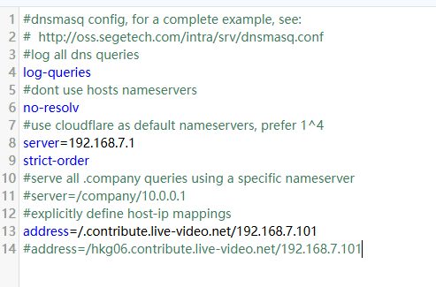
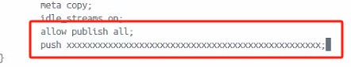
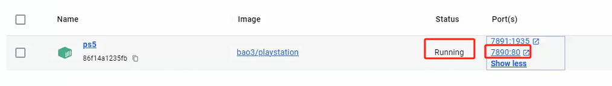
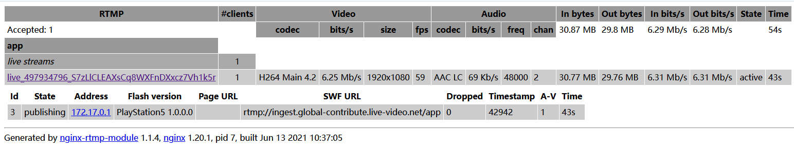

## 2025.8.11 :

-       nslookup hkg06.contribute.live-video.net 运行_dnsmasq电脑_ip
看看返回的是不是 192.168.7.101。如果不是，说明规则没走到。

-       dig hkg06.contribute.live-video.net
看返回 IP 是否是 192.168.7.101。

## 2025.5.20 更新：
**_twittch推流地址可能有变化，现在改成下图这个才能抓到推流_**

-       address=/.contribute.live-video.net/192.168.7.101

没找到官方推流地址的发布页

## 2024.11.12更新：

在[这里](#2上方步骤结束并且出现一条推流信息后)增加完成截图

---

## 前置条件：_会用docker，有梯子，会开局域网共享连接，有twitch账号，有ps5，_
ps5绑定twitch账号方法请自行百度：）

# 1.首先安装docker-desktop
教程网上都有

## 2.安装好后
**_需要梯子，不然找不到镜像_**

cmd打开，输入如下

-     docker pull bao3/playstation

-     docker run -d -it -p 7890:80 -p 1935:1935 --restart always --name ps5living bao3/playstation

| **-p x:y意为将容器需要的y端口劫持/重定向/映射到电脑上面的x端口** |
|---------------------------------------------------------------------------|
| **因为电脑本身的y端口比较热门/被别的用了/不喜欢这个端口号/就是想改**  |

--restart always如果知道意思可以不用写，不知道建议写。7890端口可以自定义，前面的1935端口  **_也可以自定义?_**

--name后 ps5living 可以自定义

最后的bao3/playstation为镜像名,不可更改

## 3.运行完命令后
容器会自动开始运行

点击 **ps5living(取决于--name后的自定义名称)** 进入容器内部

切换到Exec标签页，输入

-     vi /etc/nginx/nginx.conf

输入 **_大写G_** 跳转到页面最底

将光标移动到带#的三行，输入小写dd删除

接着按insert切换为输入模式，输入

-     allow publish all;

-     push rtmp://live-push.bilivideo.com/live-bvc/?streamname=live&key=&schedule=rtmp&pflag=1;

| **_改成自己的推流地址!!!_**|
|-----------------------------------------------------------------------|
| **_服务器地址和串流秘钥粘贴到一起，中间不需要空格，结尾别忘了分号!!!_**|

随后按 **esc** ，输入 **_:wq_** ，回车，重启该服务

## 4.重启后点击7890:80

打开该网页，当抓取到流之后在此会显示，图片后期补充

# b站粉丝数不足无法获取推流地址解决办法
脚本：

- https://github.com/ProgramRipper/BLiveWeb

安装好以后访问

- https://link.bilibili.com/p/center/index#/my-room/start-live

打开b站自己的开播界面就可以获取推流码了

# 1.安装dnsmasq劫持镜像
**_需要梯子，不然找不到镜像_**

依旧打开cmd输入以下两行

-     docker pull jpillora/dnsmasq

-     docker run --name dnsmasq -d -p 5353:53/udp -p 8081:8080 -e "HTTP_USER=yx" -e "HTTP_PASS=123456" --restart always jpillora/dnsmasq

5353端口和 **_8081端口可以自定义?_**

USER和PASS是账号密码，自定义后记得保存

点击8080进入网页端，输入上方命令设置的账号密码登录进去，替换下方标注的两项，其余不用动

**_并列两行server删除一行，另一行替换为自己的路由IP_**

-     server=192.168.7.1

**_address地址为twitch推流地址，可能会变，建议路由器后台查询上行域名_**

**_address的" / "后地址为开着docker的电脑ip，cmd-ipconfig查询ipv4地址即可_**

~~address=/ingest.global-contribute.live-video.net/192.168.7.101~~

参考[2025.5.20](#2025520-更新)更新

~~如下图所示~~

配置好后点击左侧重启即可，此时[bao3网页端](#4重启后点击789080)应该会显示一条推流信息

## 2.上方步骤结束并且出现一条推流信息后

| ps5连接的网络需要将首选dns更改为开着docker的电脑ip |
|--------------------------------------------------------------------|
|cmd-config获取ipv4地址即可|
|配置好push链接后，记得在直播间先点击开播|

接着ps5开始推流twitch ，此时[bao3网页端](#4重启后点击789080)应该会显示两条推流信息

此时应该就可以在直播间显示画面了

# 3.如果直播间需要显示声音
就需要在ps5系统设置和推流设置里面打开允许采集麦克风声音，再取消手柄的静音，或许就可以让说话声出现在直播间了(等待验证)