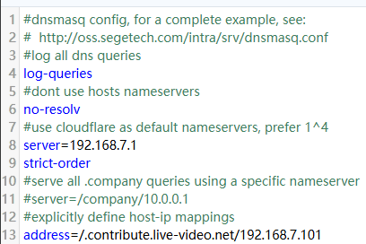

# PS5 Twitch 推流到 B站 配置教程

## 更新日志

### 2025-08-11

测试 DNS 规则是否生效：

```bash
nslookup hkg06.contribute.live-video.net 运行_dnsmasq电脑_ip
```

看看返回的是不是 `192.168.7.101`。如果不是，说明规则没走到。

```bash
dig hkg06.contribute.live-video.net
```

看返回 IP 是否是 `192.168.7.101`。


---

### 2025-05-20

> **重要**：Twitch 推流地址可能有变化，现在改成下图这个才能抓到推流。



```
address=/.contribute.live-video.net/192.168.7.101
```

> **注意**：没找到官方推流地址的发布页。

---

### 2024-11-12

在[这里](#上方步骤结束并且出现一条推流信息后)增加完成截图。

---

## 前置条件

> **前置条件**：会用 Docker，有梯子，会开局域网共享连接，有 Twitch 账号，有 PS5。

> PS5 绑定 Twitch 账号方法请自行百度：）

## 1. 首先安装 Docker Desktop

教程网上都有。

---

## 2. 安装好后

> **重要**：需要梯子，不然找不到镜像。

CMD 打开，输入如下：

```bash
docker pull bao3/playstation
```

```bash
docker run -d -it -p 7890:80 -p 1935:1935 --restart always --name ps5living bao3/playstation
```

> **说明**：
> - `-p x:y` 意为将容器需要的 y 端口劫持/重定向/映射到电脑上面的 x 端口
> - 因为电脑本身的 y 端口比较热门/被别的用了/不喜欢这个端口号/就是想改

- `--restart always` 如果知道意思可以不用写，不知道建议写
- `7890` 端口可以自定义，前面的 `1935` 端口也可以自定义
- `--name` 后 `ps5living` 可以自定义
- 最后的 `bao3/playstation` 为镜像名，不可更改

## 3. 运行完命令后

容器会自动开始运行。

点击 **ps5living**（取决于 `--name` 后的自定义名称）进入容器内部。

切换到 Exec 标签页，输入：

```bash
vi /etc/nginx/nginx.conf
```

输入 **大写 G** 跳转到页面最底：


将光标移动到带 `#` 的三行，输入小写 `dd` 删除。

接着按 `insert` 切换为输入模式，输入：

```
allow publish all;
```

```
push rtmp://live-push.bilivideo.com/live-bvc/?streamname=live&key=&schedule=rtmp&pflag=1;
```

> **重要**：
> - 改成自己的推流地址！！！
> - 服务器地址和串流秘钥粘贴到一起，中间不需要空格，结尾别忘了分号！！！


随后按 **ESC**，输入 **`:wq`**，回车，重启该服务。

---

## 4. 重启后点击 7890:80


打开该网页，当抓取到流之后在此会显示，图片后期补充。

---

## B站粉丝数不足无法获取推流地址解决办法

脚本：https://github.com/ProgramRipper/BLiveWeb

安装好以后访问：https://link.bilibili.com/p/center/index#/my-room/start-live

打开 B站自己的开播界面就可以获取推流码了。

---

## 1. 安装 dnsmasq 劫持镜像

> **重要**：需要梯子，不然找不到镜像。

依旧打开 CMD 输入以下两行：

```bash
docker pull jpillora/dnsmasq
```

```bash
docker run --name dnsmasq -d -p 5353:53/udp -p 8081:8080 -e "HTTP_USER=yx" -e "HTTP_PASS=123456" --restart always jpillora/dnsmasq
```

- `5353` 端口和 `8081` 端口可以自定义
- `USER` 和 `PASS` 是账号密码，自定义后记得保存


点击 `8080` 进入网页端，输入上方命令设置的账号密码登录进去，替换下方标注的两项，其余不用动：


> **配置说明**：
> - 并列两行 server 删除一行，另一行替换为自己的路由 IP：`server=192.168.7.1`
> - address 地址为 Twitch 推流地址，可能会变，建议路由器后台查询上行域名
> - address 的 `/` 后地址为开着 Docker 的电脑 IP，CMD-ipconfig 查询 IPv4 地址即可

~~`address=/ingest.global-contribute.live-video.net/192.168.7.101`~~

参考 [2025-05-20](#2025-05-20) 更新。

配置好后点击左侧重启即可，此时 [bao3 网页端](#4-重启后点击-789080) 应该会显示一条推流信息：


---

## 2. 上方步骤结束并且出现一条推流信息后

> **重要**：
> - PS5 连接的网络需要将首选 DNS 更改为开着 Docker 的电脑 IP（CMD-ipconfig 获取 IPv4 地址即可）
> - 配置好 push 链接后，记得在直播间先点击开播

接着 PS5 开始推流 Twitch，此时 [bao3 网页端](#4-重启后点击-789080) 应该会显示两条推流信息：


此时应该就可以在直播间显示画面了。

---

## 3. 如果直播间需要显示声音

就需要在 PS5 系统设置和推流设置里面打开允许采集麦克风声音，再取消手柄的静音，或许就可以让说话声出现在直播间了（等待验证）。